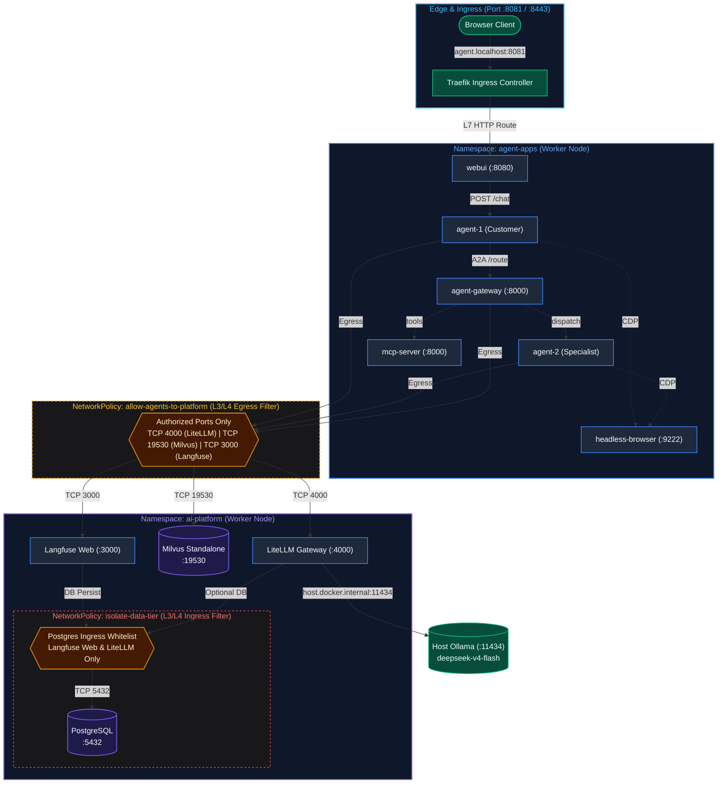

# DESIGN: BeSA Agent Platform on k3d-Rancher

## 1. Cluster Topology, Namespaces & Helm/Manifest Directory Layout

- **Cluster Decision**: Target Rancher's existing `local` cluster (k3s on `:8443`). Downstream/imported clusters (e.g. `ai-demo`) are avoided to prevent Docker localhost TLS loopback and host port collision issues. Multi-tenancy is achieved strictly via Namespace isolation.
- **Node Topology & Scheduling Policy**:
  - `k3d-rancher-cluster-server-0`: Control plane & master node (`node-role.kubernetes.io/control-plane:NoSchedule` taint). Reserved exclusively for K3s control plane, Rancher core, and edge load balancers (Traefik svclb).
  - `k3d-rancher-cluster-agent-0`: Dedicated worker node (`node-role.kubernetes.io/worker=worker`). All platform infra (`ai-platform`) and agent applications (`agent-apps`) schedule strictly here.
  - Workload manifests enforce worker placement via `nodeAffinity` targeting `node-role.kubernetes.io/control-plane DoesNotExist`, preventing AI workloads from competing with or degrading control plane stability.
  - **Node Taint & Worker Labeling Operational Commands**:
    ```powershell
    # 1. Label the worker node with standard worker role
    kubectl label node k3d-rancher-cluster-agent-0 node-role.kubernetes.io/worker=worker --overwrite

    # 2. Taint control plane node to prevent non-system workloads from scheduling on it
    kubectl taint nodes k3d-rancher-cluster-server-0 node-role.kubernetes.io/control-plane:NoSchedule --overwrite

    # 3. Apply updated LiteLLM manifest (with nodeAffinity) and trigger rolling recreation
    kubectl apply -f k8s/platform/30-litellm.yaml
    kubectl rollout restart deployment/litellm -n ai-platform
    kubectl rollout status deployment/litellm -n ai-platform

    # 4. Verify pod relocated to k3d-rancher-cluster-agent-0
    kubectl get pods -n ai-platform -o wide
    ```
- **Namespaces**:
  - `ai-platform`: Platform shared services (`litellm`, `milvus-standalone`, `langfuse-web`, `postgres`).
  - `agent-apps`: Agent application layer (`webui`, `agent-1`, `agent-2`, `agent-gateway`, `mcp-server`, `headless-browser`).
- **Directory Layout**:
  ```text
  agent-platform-k3d/
  ├── DESIGN.md
  ├── k8s/
  │   ├── namespaces/           # 00-namespaces.yaml
  │   ├── platform/             # 10-postgres.yaml, 20-milvus.yaml, 30-litellm.yaml, 40-langfuse.yaml
  │   ├── apps/                 # 50-mcp.yaml, 60-sandbox.yaml, 70-gateway.yaml, 80-agents.yaml, 90-webui.yaml
  │   ├── ingress/              # traefik-routes.yaml
  │   └── policies/             # network-policies.yaml
  ```

## 2. Workload & Service Dependency Graph

### 2.1 High-Level Architecture & Tier Boundaries



### 2.2 Runtime Call Sequence

```text
Browser
  └─► Traefik (:8081 / :8443)
        └─► webui (:8080)
              └─► agent-1 (:8080)
                    ├─► [allow-agents-to-platform] ──► litellm (:4000) ──► host.docker.internal:11434 (Ollama)
                    ├─► [allow-agents-to-platform] ──► milvus (:19530) [RAG context retrieval]
                    ├─► agent-gateway (:8000)
                    │     ├─► agent-2 (:8080) [Specialist delegation]
                    │     └─► mcp-server (:8000) [Orders/Inventory tools]
                    └─► [allow-agents-to-platform] ──► langfuse-web (:3000)
                                                          └─► [isolate-data-tier] ──► postgres:5432 [Trace persist]
```

## 3. ConfigMaps, Secrets, PVC Storage & Ingress/Traefik Routing Matrix

| Workload                | Type        | Storage (local-path)       | Secrets / ConfigMaps                                    | Ingress Route (Host / Path)   |
| :---------------------- | :---------- | :------------------------- | :------------------------------------------------------ | :---------------------------- |
| **postgres**      | StatefulSet | `pvc-postgres` (5Gi)     | `postgres-secret` (db, user, pass)                    | N/A (ClusterIP)               |
| **milvus**        | Deployment  | `pvc-milvus-data` (10Gi) | `milvus-config` (standalone etcd/minio)               | N/A (ClusterIP)               |
| **langfuse**      | Deployment  | None (uses postgres)       | `langfuse-secret` (keys, salts, db-url)               | `langfuse.localhost:8443`   |
| **litellm**       | Deployment  | None                       | `litellm-config` (model aliases -> host.k3d.internal) | `litellm.localhost:8443/v1` |
| **mcp-server**    | Deployment  | None                       | `mcp-config` (tool registries)                        | N/A (ClusterIP)               |
| **browser**       | Deployment  | None                       | None (ephemeral container sandbox)                      | N/A (ClusterIP)               |
| **agent-gateway** | Deployment  | None                       | `gateway-policy` (routing tables, A2A auth)           | N/A (ClusterIP)               |
| **agent-1 / 2**   | Deployment  | None                       | `agent-config` (LITELLM_BASE_URL, MILVUS_URI)         | N/A (ClusterIP)               |
| **webui**         | Deployment  | None                       | `webui-config` (AGENT_ENDPOINT)                       | `agent.localhost:8443`      |

- **NetworkPolicies**:
  - `allow-agents-to-platform`: Allow pods in `agent-apps` with label `role=agent` to egress to `ai-platform` ports 4000 (LiteLLM), 19530 (Milvus), 3000 (Langfuse).
  - `isolate-data-tier`: Deny direct ingress to `postgres` from all namespaces except `langfuse`.

## 4. Health Checks, Readiness Gates & Dependency Validation Strategy

- **Readiness & Liveness Matrix**:
  - `postgres`: `pg_isready -U postgres` on port 5432.
  - `milvus`: HTTP GET `/v1/vector/health` (or TCP probe on 19530).
  - `litellm`: HTTP GET `http://litellm:4000/health/readiness` (validates upstream Ollama connectivity).
  - `langfuse`: HTTP GET `http://langfuse-web:3000/api/public/health`.
  - `mcp-server`: HTTP GET `http://mcp-server:8000/healthz`.
  - `agent-gateway`: HTTP GET `http://agent-gateway:8000/healthz`.
  - `agent-1 / 2`: HTTP GET `http://agent-1:8080/healthz`.
  - `webui`: HTTP GET `http://webui:8080/healthz`.
- **Topological Boot Sequence Validation**:
  - `initContainers` / `wait-for-it` checks:
    1. Langfuse waits for Postgres readiness.
    2. Agents wait for LiteLLM and Milvus readiness before starting event-loops.
    3. WebUI waits for Agent-1 `/healthz`.
- **E2E Synthetic Probes & Local Host Validation**:
  - Traefik ingress probe: `curl -k https://agent.localhost:8443/healthz` (full edge routing).
  - Host port-forward verification (internal probe):
    `kubectl port-forward svc/litellm -n ai-platform 4000:4000`
    `curl http://localhost:4000/health/readiness`

## 5. Phase Breakdown & Definition of Done (DoD)

```text
Phase 1: Base Platform  ──►  Phase 2: State & Tracing  ──►  Phase 3: Agent Mesh  ──►  Phase 4: Edge & E2E
 • namespaces (00)            • postgres (10)                 • mcp-server (50)        • webui (90)
 • storage PVCs (01)          • milvus (20)                   • browser sandbox (60)   • traefik-routes
 • litellm gateway (30)       • langfuse-web (40)             • agent-gateway (70)     • network-policies
                                                              • agent-1 & agent-2 (80)
```

### Phase 1: Shared Platform Infra & LiteLLM Gateway

- **Target Files**: `k8s/namespaces/00-namespaces.yaml`, `k8s/platform/01-storage-pvcs.yaml`, `k8s/platform/30-litellm.yaml`.
- **DoD Probes & Synthetic Checks**:
  - `kubectl get ns ai-platform agent-apps` -> Status `Active`.
  - `kubectl wait --for=condition=Ready pod -l app=litellm -n ai-platform --timeout=60s`.
  - `kubectl exec -n ai-platform deploy/litellm -- curl -s http://localhost:4000/health/readiness` -> Upstream Ollama check OK.
- **Pass Threshold**: 100% of readiness checks pass.

### Phase 2: State & Observability Tier (Milvus + Langfuse + Postgres)

- **Target Files**: `k8s/platform/10-postgres.yaml`, `k8s/platform/20-milvus.yaml`, `k8s/platform/40-langfuse.yaml`.
- **DoD Probes & Synthetic Checks**:
  - PVCs `pvc-postgres` and `pvc-milvus-data` are `Bound`.
  - `kubectl wait --for=condition=Ready pod -l tier=data-observability -n ai-platform --timeout=120s`.
  - `kubectl exec -n ai-platform statefulset/postgres -- pg_isready -U postgres` (Exit code 0).
  - `kubectl exec -n ai-platform deploy/milvus -- curl -s http://localhost:19530/v1/vector/health` (HTTP 200).
  - `kubectl exec -n ai-platform deploy/langfuse-web -- curl -s http://localhost:3000/api/public/health` (HTTP 200).
- **Pass Threshold**: 100% pass across all 3 data/telemetry endpoints.

### Phase 3: Agent & Tooling Tier (MCP + Sandbox + Gateway + Agents)

- **Target Files**: `k8s/apps/50-mcp.yaml`, `k8s/apps/60-sandbox.yaml`, `k8s/apps/70-gateway.yaml`, `k8s/apps/80-agents.yaml`.
- **DoD Probes & Synthetic Checks**:
  - `kubectl wait --for=condition=Ready pod -l tier=agent-runtime -n agent-apps --timeout=90s`.
  - `kubectl exec -n agent-apps deploy/mcp-server -- curl -s http://localhost:8000/healthz` (HTTP 200).
  - `kubectl exec -n agent-apps deploy/agent-gateway -- curl -s http://agent-2:8080/healthz` (A2A reachability).
  - `kubectl exec -n agent-apps deploy/agent-1 -- curl -s http://litellm.ai-platform.svc.cluster.local:4000/health/liveliness` (Cross-namespace DNS OK).
- **Pass Threshold**: 100% inter-service mesh connectivity.

### Phase 4: Ingress, WebUI & End-to-End Validation

- **Target Files**: `k8s/apps/90-webui.yaml`, `k8s/ingress/traefik-routes.yaml`, `k8s/policies/network-policies.yaml`.
- **DoD Probes & Synthetic Checks**:
  - `kubectl wait --for=condition=Ready pod -l app=webui -n agent-apps --timeout=60s`.
  - Traefik ingress routing: `curl -k -s -o /dev/null -w "%{http_code}" https://agent.localhost:8443/healthz` == `200`.
  - NetworkPolicy isolation: Deny direct TCP to port 5432 from `agent-apps` namespace verified.
  - End-to-end chat flow: POST request to WebUI endpoint successfully streams token response and generates trace ID in Langfuse.
- **Pass Threshold**: 100% across Ingress routing, NetworkPolicy enforcement, and end-to-end trace generation.
