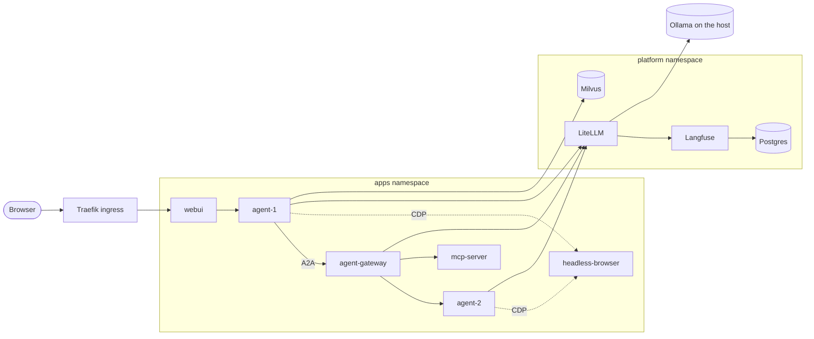

# agent-platform-k3d

[](https://github.com/ly2xxx/agent-platform-k3d/actions/workflows/ci.yml)

A multi-agent AI platform on a local Kubernetes cluster (k3d + Rancher), installed with one Helm chart. Two cooperating agents, a tool server and a browser sandbox run behind a LiteLLM model gateway, with every LLM call traced in Langfuse.

It is a local port of the AWS BeSA **"AI agents on EKS"** workshop. The workshop runs on EKS with Amazon Bedrock; this runs on a laptop, with LiteLLM routing to models served by Ollama on the host.

## What it runs

| Namespace | Component | What it does |
| :-- | :-- | :-- |
| platform | **LiteLLM** | Model gateway: one OpenAI-compatible API in front of the Ollama models, with keys, logs and a UI |
| platform | **Langfuse** + Postgres | Traces, token usage and latency for every call through LiteLLM |
| platform | **Milvus** | Vector store for retrieval |
| apps | **webui** | Chat front end, behind Traefik |
| apps | **agent-1** / **agent-2** | Customer-facing agent and specialist agent, talking agent-to-agent (A2A) |
| apps | **agent-gateway** | Routes A2A requests and tool calls |
| apps | **mcp-server** | Tools (orders, inventory) over MCP |
| apps | **headless-browser** | Browser sandbox the agents drive over CDP |

Plus NetworkPolicies between the tiers, Traefik ingress, and a `helm test` pod that runs the health probes. The six app workloads are stock `python:3.11-slim` running standard-library HTTP servers loaded from ConfigMaps, so **there is no application image to build**.



The full dependency graph, network-policy boundaries and call sequence are in [DESIGN.md](DESIGN.md).

## Quick start

You need Docker Desktop, [k3d](https://k3d.io), `kubectl`, Helm 3 and [Ollama](https://ollama.com) with the models listed in [`values.yaml`](helm/besa-agent-platform/values.yaml) (`platform.litellm.models`).

**1. A cluster.** The [k3d + Rancher lab](https://github.com/ly2xxx/DevOps-labs/tree/main/k3d-rancher) creates `rancher-cluster`, a control-plane node plus one worker. [DESIGN.md §1](DESIGN.md) covers the taint and worker label that keep AI workloads off the control plane.

**2. Install** (PowerShell, from `helm/besa-agent-platform`):

```powershell
cd helm\besa-agent-platform

# Namespaces first, rendered from the chart so step 2 can adopt them
helm template besa-dev . -n ai-platform-dev -f values-dev-8086.yaml `
  -s templates/00-namespaces.yaml | kubectl apply -f -

helm upgrade --install besa-dev . -n ai-platform-dev -f values-dev-8086.yaml --wait --timeout 12m

# Publish the web UI's NodePort on the host (Helm can't do this part)
k3d cluster edit rancher-cluster --port-add "8086:30086@loadbalancer"
curl.exe -s http://localhost:8086/healthz
```

`values-dev-8086.yaml` joins the namespaces to a Rancher project by ID, and that ID is specific to one cluster. On yours, add `--set rancher.projectId= --set rancher.projectName=` to skip it, or set your own (`kubectl get projects.management.cattle.io -n local`).

**3. Check it.**

```powershell
helm test besa-dev -n ai-platform-dev --logs
..\..\scripts\verify-helm-release.ps1 -ProjectId ""   # pods, services, policies, ingress, end to end
```

Tracing starts once you give LiteLLM a Langfuse project's keys; see [the chart README](helm/besa-agent-platform/README.md#wire-litellm-to-langfuse). That README also covers external access, running under a Rancher project quota, and uninstalling.

## Credentials

None are in this repo. The chart generates the Postgres password, LiteLLM's master key and UI password, and Langfuse's secrets on first install, and keeps them on every upgrade, so a `helm upgrade` can never rotate a database password out from under its data. Values you pass explicitly win. The agents get their LiteLLM key from a Secret, not from their ConfigMap. Details, and how to read a value, are under [Credentials](helm/besa-agent-platform/README.md#credentials) in the chart README.

The raw manifests in [`k8s/`](k8s/) get theirs from [`scripts/new-dev-secrets.ps1`](scripts/new-dev-secrets.ps1), which follows the same rule: generate what is missing, keep what exists.

## How it was built

The build was phased, and AI-assisted with a gate at every phase:

1. **Design first.** [DESIGN.md](DESIGN.md) fixed the topology, dependency graph, secrets and routing, health checks, and a definition of done per phase before any manifest existed.
2. **A driving prompt.** [`ai-coding-prompt_20260907-BeSA-localk3d.txt`](ai-coding-prompt_20260907-BeSA-localk3d.txt) is the brief the implementation was generated from, phase by phase.
3. **Phases with review gates.** [PHASED.md](PHASED.md) records each phase: what was built, the exact commands, and a review gate. Phases 1–4 (platform, state and observability, agents and tools, ingress and end to end) each have a verification script in [`scripts/`](scripts/). Phase 5, a LangGraph assistant, is planned.
4. **Raw manifests, then a chart.** Phases 1–4 shipped as plain manifests in [`k8s/`](k8s/). The [Helm chart](helm/besa-agent-platform/) then parameterised them, so the whole stack can be installed more than once on one cluster without the copies reaching into each other.

## Design decisions

- **AI workloads stay off the control plane.** The control-plane node is tainted and every workload requires a worker node, so a model call can't starve k3s or Rancher.
- **Two namespaces with NetworkPolicies between them.** Agents may reach LiteLLM, Milvus and Langfuse on their ports and nothing else in the platform tier; only Langfuse and LiteLLM may reach Postgres.
- **Startup probes for migrations.** LiteLLM and Langfuse migrate their schemas on first boot, which outlasts a liveness probe; without a startup probe the pods are killed mid-migration in a loop.
- **`Recreate` rollouts.** Under a Rancher project quota sized for one copy of the stack, a rolling update can't admit its surge pod and stalls.

## Repository layout

```text
DESIGN.md                    architecture, dependency graph, health checks, definition of done
PHASED.md                    phase-by-phase build log with review gates
ai-coding-prompt_*.txt       the brief the build was generated from
helm/besa-agent-platform/    the Helm chart (supported install path)
k8s/                         the raw manifests from phases 1-4
scripts/                     verification per phase and for the Helm release; secrets for k8s/
docs/                        Langfuse <-> LiteLLM wiring
```

## CI

Every push and pull request:

- lints the chart and renders it with default and dev values;
- validates every rendered object and every raw manifest against the Kubernetes 1.30 schemas, in strict mode;
- fails if a known default credential reappears in the chart output or anywhere in the repo, and scans for secrets with gitleaks;
- compiles the Python services and parses every PowerShell script.

## Known limitations

- **The agents use LiteLLM's master key.** Least privilege would be a LiteLLM virtual key per agent, with its own budget and model list. That is the next change.
- **Secrets are plain Kubernetes Secrets**, base64-encoded rather than encrypted unless the cluster enables encryption at rest. Anywhere real, back them with an external secret store.
- **On k3d under WSL2 the CNI does not enforce the `isolate-data-tier` policy**, so the Postgres boundary is documented but not enforced there. The chart README has the details.
- Storage is `local-path` on a single worker node; this is a development cluster, not a production layout.

## Credits

Adapted from the AWS BeSA (Become a Solutions Architect) programme's **"AI agents on EKS"** workshop. The workshop's own code is not included here. The services, manifests and chart in this repo were written for this local port.
