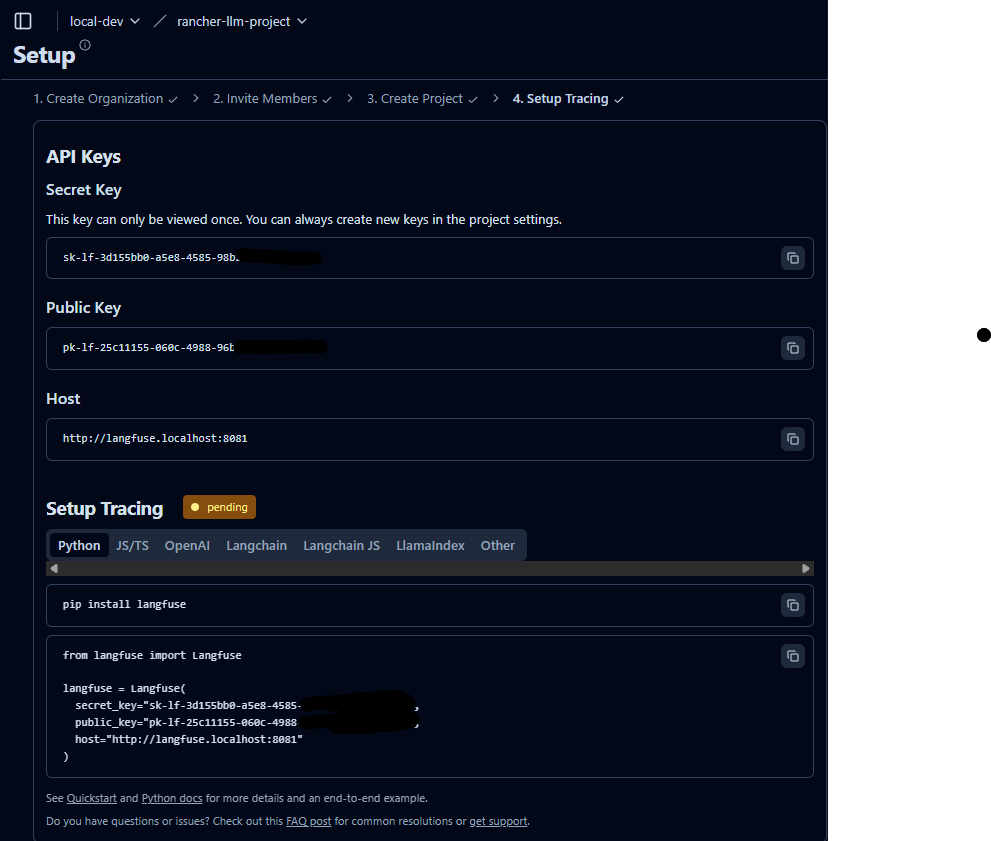

# Langfuse Integration with LiteLLM

This document outlines how Langfuse observability is wired into LiteLLM on the local k3d/Rancher cluster.

---

## 1. Create the Langfuse project and keys

A fresh Langfuse has no project keys. In the Langfuse UI, create an organization and a project (here `local-dev` / `rancher-llm-project`). The setup screen then issues a public key and a secret key; the secret key is shown only once.



- **Host Endpoint (Host Machine / Browser / External Python SDK)**: `http://langfuse.localhost:8081`
- **Host Endpoint (In-Cluster Service)**: `http://langfuse-web.ai-platform.svc.cluster.local:3000`

The keys belong in the cluster, never in this repo.

---

## 2. Give the keys to LiteLLM

**Raw manifests.** Write them into `litellm-secret`:

```powershell
.\scripts\new-dev-secrets.ps1 -LangfusePublicKey pk-lf-... -LangfuseSecretKey sk-lf-...
```

[`k8s/platform/30-litellm.yaml`](../k8s/platform/30-litellm.yaml) reads them from there:

```yaml
            - name: LANGFUSE_PUBLIC_KEY
              valueFrom: { secretKeyRef: { name: litellm-secret, key: LANGFUSE_PUBLIC_KEY } }
            - name: LANGFUSE_SECRET_KEY
              valueFrom: { secretKeyRef: { name: litellm-secret, key: LANGFUSE_SECRET_KEY } }
            - name: LANGFUSE_HOST
              value: "http://langfuse-web.ai-platform.svc.cluster.local:3000"
```

**Helm chart.** Pass them to `helm upgrade` with `--set platform.langfuse.publicKey=pk-lf-... --set platform.langfuse.secretKey=sk-lf-...`; see "Wire LiteLLM to Langfuse" in the [chart README](../helm/besa-agent-platform/README.md).

Either way, the callbacks are switched on in LiteLLM's ConfigMap (`litellm-config`):

```yaml
    litellm_settings:
      drop_params: true
      telemetry: false
      success_callback: ["langfuse"]
      failure_callback: ["langfuse"]
```

> **Note on In-Cluster Networking:** Inside Kubernetes, pods talk directly to `http://langfuse-web.ai-platform.svc.cluster.local:3000` via CoreDNS rather than routing out to the host-level Ingress endpoint (`http://langfuse.localhost:8081`).

---

## 3. Restart LiteLLM

A Secret change does not restart the pods that read it:

```powershell
kubectl rollout restart deployment/litellm -n ai-platform
kubectl rollout status deployment/litellm -n ai-platform
```

---

## 4. Verification

### Send a Test Request to LiteLLM
```powershell
$env:LITELLM_KEY = [Text.Encoding]::UTF8.GetString([Convert]::FromBase64String((kubectl get secret litellm-secret -n ai-platform -o jsonpath='{.data.LITELLM_MASTER_KEY}')))

curl.exe -X POST "http://litellm.localhost:8081/v1/chat/completions" `
  -H "Content-Type: application/json" `
  -H "Authorization: Bearer $env:LITELLM_KEY" `
  -d '{\"model\": \"default-model\", \"messages\": [{\"role\": \"user\", \"content\": \"Hello Langfuse!\"}]}'
```

### Check Langfuse Dashboard
1. Open `http://langfuse.localhost:8081` in your browser.
2. Select **rancher-llm-project**.
3. Navigate to **Tracing** / **Generations** to view the recorded LLM call, token usage, latency, and model metrics.
